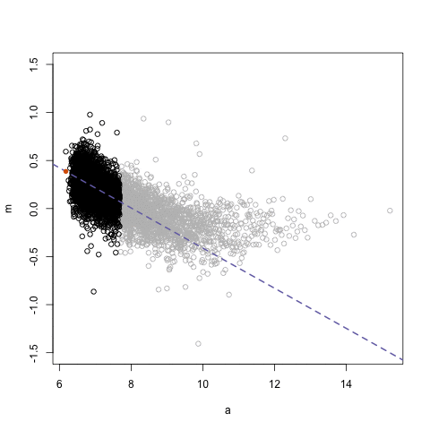
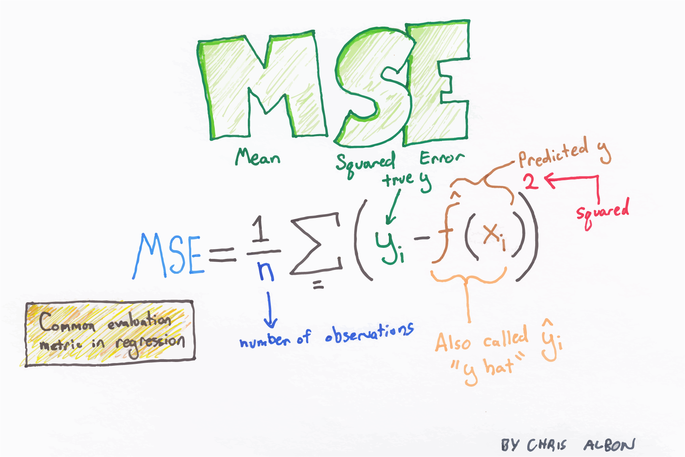
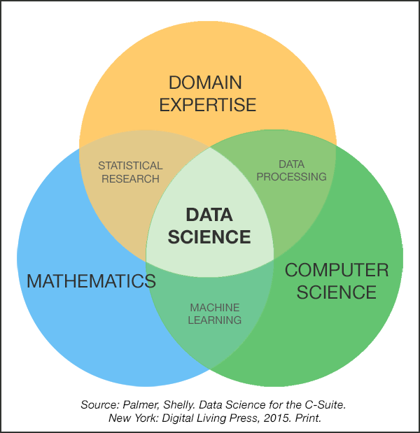
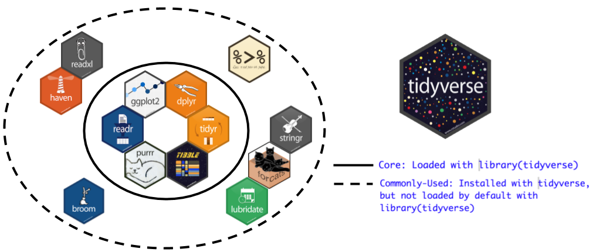

<style>
h1{font-weight: 400;}
</style>

```{r setup, include=FALSE}
knitr::opts_chunk$set(echo = TRUE, message=FALSE, warning = FALSE)
library(tidyverse)
library(broom)
library(knitr)
library(modelr)
library(lubridate)
library(forcats)
library(nycflights13)
library(Quandl)
# devtools::install_github("hadley/emo")
library(emo)
set.seed(76)
```

```{r, eval=FALSE, echo=FALSE}
# Run this separately to have slide output:
rmarkdown::render("index.Rmd", output_format = c("ioslides_presentation"), output_file = "slides.html")
```


```{r, eval=FALSE, echo=FALSE}
# Code to randomly assign students to groups:
library(tidyverse)
class <- c("Brenna", "Anthony", "Abbas", "Sara", "Sarah", "Jonathan", "Harrison", "Tasheena", "Leonard", "Timothy", "Jenn", "Kiryu", "Jeff", "Vickie", "Pei", "Luke", "Brendan", "Caleb", "Meron", "Christien", "Wayne", "Meredith")
set.seed(76)
sample(class) %>% matrix(nrow=2) %>% tbl_df() %>% knitr::kable()
```


***


The lectures are numbered according to the following rough topic outline below. A detailed topic schedule and corresponding readings can be found [here](https://docs.google.com/spreadsheets/d/e/2PACX-1vSoT25RqvzJrr563nky-ANl_EiM39NruG2fkH8fykFxMwk8JXILo5AbdEKtJabcBQ2QM41ab4MDe7Ab/pubhtml?gid=1289440669&single=true).

1. Background
    * ~~Intro to modeling~~ 
    * ~~Simple case with univariate predictors to start: splines~~
    * ~~Sampling/resampling, out-of-sample prediction, crossvalidation~~
    * Bias-variance tradeoff (to be covered later)
1. Continuous outcomes I
    * ~~LOESS smoother~~
    * Regression for prediction
1. Categorical outcomes i.e. classification
    * Logistic regression for prediction + ROC curves
    * k-Nearest Neighbors
    * Classification and regression trees (CART)
1. Continuous outcome II
    * Regularization/shrinkage methods: Ridge regression and LASSO
1. Other methods
    * Boosting and bagging
    * Random forests
    * Neural nets
1. Unsupervised learning (time permitting)
    * Principal components analysis
    * k-Means Clustering

The source code for this webpage is available by clicking the "Octocat" icon on the top-right of the nav bar.


***


<!--
# X.X

## Thu X/X

Announcements:


## Chalk talk

X.X


***


# X.X 

## Tue X/X

Announcements:

* Problem set 0X presentations listed [below](#PS0X).


***


# Problem set 0X {#PS0X}

## Information

*Assigned on Tue X/X, due on Tue X/X 9am at which point there will be synchronized pull requests.*

You will...

* Due: Tue X/X 9:00am, at which point there will be synchronized pull requests.
* Teams: 
* Deliverables: One ready to submit *pull request* to the [PS0X repo](https://github.com/2017-09-Amherst-STAT495/PS0X) (recall the GitHub [submission process](https://github.com/2017-09-Amherst-STAT495/README#problem-set-submission-process)). At the very least, the following files should be modified/added:
    1. `PS0X.Rmd`: This should
    1. `PS0X.html`: The output of `PS0X.Rmd`. This will be the presentation file for a randomly chosen set of groups.
    1. `README.md`: Change `rudeboybert` in the URL to the GitHub ID of the team leader so that you can open your team's version of `PSX2.html` in a browser on Tuesday morning.
* Tips:
* Hints:


## Presentations


## Feedback


## Example solutions


***
-->


# A step back

## Mon 9/5

Announcements:

* Explain GitHub collaborator vs GitHub pull request
* Problem set 02 feedback and example solutions given tomorrow.
* Today: ~~2.2 Regression for prediction~~ A step back


## Chalk talk

2.2 A step back. Recall our "projection onto the sheet" exercise


## StitchFix

* Disclosure: I'm not being compensated by StitchFix.
* Filed for an IPO (to start trading on the stock market) in [July 2017](https://www.recode.net/2017/7/29/16059140/stitch-fix-delivery-clothing-ipo-filing-ceo-katrina-lake).
* Feature on Good Morning America; watch it thru the lens of
    + $y=f(\vec{x})+\epsilon$
    + What machine learning/data science tries to do  

<iframe src='http://abcnews.go.com/video/embed?id=49810458' autostart="1" width='640' height='360' scrolling='no' style='border:none;'></iframe>


## Today's exercise

1. Go to Stitch Fix and individually complete the "style quiz" for your gender; I just like their approach (their [blog](http://multithreaded.stitchfix.com/blog/) for example).
1. Log out and using a different email address complete the "style quiz" for the *opposite* gender and note the major differences.
1. Communicate with your seatmates every step of the way; I'll poll some groups for their observations.
1. Again, view all this thru the lens of:
    + $y=f(\vec{x})+\epsilon$
    + What machine learning/data science tries to do  


<!--

## Important questions

* The **ethics** of StitchFix and predictive machine learning in general: What are we predicting, but also what are we *reinforcing*?
* Later in course: [Weapons of Math Destruction](https://weaponsofmathdestructionbook.com/).


-->


***


# 2.1 Local regression (LOESS)

## Thu 9/21

Before class:

* Install the following packages:
    + [`fivethirtyeight`](https://rudeboybert.github.io/fivethirtyeight/): Data
    from the articles on FiveThirtyEight
    + [`nycflights13`](https://github.com/hadley/nycflights13): Info
    for all 336K domestic flights that left an NYC airport in 2013 (JFK, EWR, or
    LGA)
* AC students: Start networking! Have your name and LinkedIn profile appear on 
the [Amherst website](https://www.amherst.edu/academiclife/departments/mathematics-statistics/alumni/alumni-links) by filling out this [Google Form](https://docs.google.com/forms/d/1LW1E50wXVGW3-I0949pvRnqrm7M8E5nfADQWlx1YCPc/edit). Recruiters pay `r emo::ji("dollar")``r emo::ji("money")``r emo::ji("currency")` to LinkedIn to be able to do 
targeted `r emo::ji("search")`s of potential hires!

Announcements:

* Amherst College Department of Mathematics and Statistics Amherst College Statistics Colloquia tonight. 
    + Title: Lessons for official statistics production around the world from the experience of Greece
    + Speaker: Andreas Georgiou ‘83, Visiting Lecturer in Economics Amherst College ([speaker background](https://www.amherst.edu/academiclife/departments/mathematics-statistics/news))
    + When/where: Thursday, September 21, 2017 7:00 pm in Seeley Mudd 206. 
    + Abstract: The seminar will address what lessons can be gleaned from the experience with official statistics production in Greece, both in the period up to the onset of the debt crisis and since then. The seminar will discuss lessons about the appropriate institutional setting, legal framework, statistical culture and statistical practices.
* Updated/clarified syllabus to reflect:
    + Typical problem set timeline under problem sets
    + Expectations on readings under materials/readings
* Add to $k=2$ CV pseudocode chalk talk from Lec 1.7: using results of CV to
then make appropriate predictions.
* Starting topic 2 today: Continuous outcomes part I.  We'll come back to the
final subtopic of topic 1, the bias-variance tradeoff, later.


## Digression: Chalk talk

2.1: $\log()$ and $\log_{10}()$ transformations.


## Digression: The importance of log-transformations

Let's consider a set of post-2000 movies from the `bechdel` data set (type `?bechdel` for
details) and plot:

* x-axis: movie budget (in 2013-inflation adjusted US dollars)
* y-axis: domestic gross (in 2013-inflation adjusted US dollars)

```{r, fig.height=9/2.5, fig.width=16/2.5}
library(tidyverse)
library(fivethirtyeight)
bechdel_2000 <- bechdel %>% 
  filter(year >= 2000)
ggplot(bechdel_2000, aes(x=budget_2013, y=domgross_2013)) +
  geom_point() +
  labs(x="Budget", y="Domestic Gross")
```

We see there is a right-skew to both the x and y-values. This is because we are
comparing big budget Hollywood blockbusters with (likely) lower budget
independent films. Hence, it's really hard to see what's going on at the
lower-end of the budget scale. Let's unskew both variables and compare not
*absolute* differences, but rather, *relative* differences i.e. differences in
"order of magnitude" using a `log10()` transformation:

```{r, fig.height=9/2.5, fig.width=16/2.5}
ggplot(bechdel_2000, aes(x=log10(budget_2013), y=log10(domgross_2013))) +
  geom_point() +
  labs(x="log10(Budget)", y="log10(Domestic Gross)")
```

We can see a little better what's going on at the lower end of the budget scale.
However the values on the axes require a little thinking to process. For example
at $x=7$, this corresponds to movies with a budget of $10^7 = 10,000,000$
dollars. So instead, let's *rescale* both axes so that they display the data in
their original units.

```{r, fig.height=9/2.5, fig.width=16/2.5}
ggplot(bechdel_2000, aes(x=budget_2013, y=domgross_2013)) +
  geom_point() +
  scale_x_log10() +
  scale_y_log10() +
  labs(x="Budget (log10-scale)", y="Domestic Gross (log10-scale)")
```

Note that

* The two plots are identical, but the values on the axes are different.
* In the rescaled x and y axes plot, equivalent distances on each axes correspond to not equivalent absolute differences, but equivalent relative/multiplicative differences. So for example, the horizontal distance on the plot from Budget = `1e+05` = $10^5$ to Budget  = `1e+06` = $10^6$ is equal to the horizontal distance on the plot from Budget = `1e+06` = $10^6$ to Budget = `1e+07` = $10^7$.


## Local regression: executive summary via `.gif`




## Chalk talk

2.1 Local regression i.e. LOESS AKA LOWESS 

Corresponding book chapters

* ISLR: 7.6
* CASI: 19.8

## Using `loess()`

Let's fit a LOESS smoother model to 

* x: (top of the hour) temperature recorded for flight
* y: departure delay for flight

on 1000 randomly sampled flights whose (x,y) values aren't missing. Commands:

* Fit a model: `loess(y~x, data)` (Note there is also a `lowess()` command, but AFAIK there is no convenient `predict()` function).
* Predict based on a model: `predict(model_loess, newdata)`

```{r, eval=FALSE}
# Install this package:
library(tidyverse)
library(nycflights13)
library(broom)

# Let's join flight and join it with weather data after setting the seed value
# for the random number generator to ensure we have "replicable randomness"
set.seed(76)
flights_sample <- flights %>% 
  left_join(weather, by=c("month", "day", "hour", "origin")) %>%
  filter(!is.na(dep_delay) & !is.na(temp)) %>% 
  sample_n(1000) %>% 
  select(temp, dep_delay) %>% 
  mutate(ID = 1:n())

# Create disjoint training and test data sets of size 500 each:  
flights_sample_train <- flights_sample %>% 
  sample_n(500)
flights_sample_test <- flights_sample %>% 
  anti_join(flights_sample_train, by="ID")

# 1. Fit model
model_loess <- loess(dep_delay ~ temp, data=flights_sample_train)

# The next two lines take the fitted model and output a data frame with the 
# original (x,y) values, but also
# * y_hat in the column .fitted.
# * y - y_hat = residual in the column .reside
# You can ignore the warnings about purrr
model_loess_df <- model_loess %>% 
  broom::augment()
View(model_loess_df)

# Plot
ggplot(model_loess_df, aes(x=temp)) +
  geom_point(aes(y=dep_delay)) +
  geom_line(aes(y=.fitted), col="red", size=1)

# 2. Pretend for a moment you don't know the true y = dep_delay, take the
# previously fitted model and make predictions on test set:
flights_sample_test <- flights_sample_test %>% 
  mutate(dep_delay_hat = predict(model_loess, newdata=flights_sample_test))

# Now let's stop pretending and compare our predictions (red points) to the
# truth (black points)
ggplot(flights_sample_test, aes(x=temp)) +
  geom_point(aes(y=dep_delay)) +
  geom_point(aes(y=dep_delay_hat), col="red", size=1)

# Now let's evaluate the RMSE
flights_sample_test %>%
  summarise(MSE = mean((dep_delay - dep_delay_hat)^2)) %>% 
  mutate(RMSE = sqrt(MSE))
```


## `geom_smooth()` uses LOESS when n < 1000

Look at the help file `?ggplot2::stat_smooth` under `method`: default for n<1000
is `loess`. 

```{r, eval=FALSE}
# When more than 1000 obs, geom_smooth uses another method
dim(flights_sample)
ggplot(flights_sample, aes(x=temp, y=dep_delay)) +
  geom_point() +
  geom_smooth(se=FALSE, col="red", size=1)

# When less than 1000 obs, geom_smooth uses LOESS
dim(flights_sample_train)
ggplot(flights_sample_train, aes(x=temp, y=dep_delay)) +
  geom_point() +
  geom_smooth(se=FALSE, col="red", size=1)

# How do I "tune" a LOESS smoother? Play around with the span value below:
ggplot(flights_sample_train, aes(x=temp, y=dep_delay)) +
  geom_point() +
  geom_smooth(se=FALSE, col="red", size=1, span=0.2)
```


***


# Problem set 3 {#PS03}

## Information

*Assigned on Thu 9/19, due on Tue 9/26 9am at which point there will be synchronized pull requests.*

<center>
<a href="http://tomaszkacmajor.pl/index.php/2016/05/01/svm-model-selection2/">

</a>
</center>

Baby's first crossvalidation! You will implement from scratch a full crossvalidation and use it to find the splines model
with the best out-of-sample predictive ability *in terms of the Root Mean Squared Error (RMSE)*. The data include the following variables:

* `ID` unique identifier variable
* `x` univariate predictor of n=3000 equally spaced values between -10 and 90
* `y` outcome variable generated from $y = f(x) + \epsilon$ where
    + $\epsilon$ is a random variable distributed with mean 0 and standard deviation $\sigma$
    + Both $f$ and $\sigma$ are only known by Albert! Not the same as the video in [Lecture 1.3](#intro_to_modeling).

Notes:

* Teams: Individual. I *highly* recommend you work in groups especially for the planning and eventually coding questions, but the ultimate code you submit should be your own.
* Deliverables: One ready to submit *pull request* to the [PS03 repo](https://github.com/2017-09-Amherst-STAT495/PS03) (recall the GitHub [submission process](https://github.com/2017-09-Amherst-STAT495/README#problem-set-submission-process)). At the very least, the following files should be modified/added:
    1. `PS03.Rmd`: Your work.
    1. `PS03.html`: The output of `PS03.Rmd`. No presentations for this problem set.
    1. `README.md`: Change `rudeboybert` in the URL to the GitHub ID so that you can open your version of `PS03.html` in a browser easily.
* Tips:
    1. We're ramping up the coding in this assignment! Don't spin your wheels!
    1. Pseudocode
        + Don't start coding right away! Make a plan of attack using *pseudocode* that is language independent: <center>

</center>
        + You don't want to conflate the **what** (the algorithm) and the **how** (the code) of the problem set. Lay out the algorithm on paper, blackboard, whiteboard, etc, first!
        + In exams, you won't be asked to write code, but rather pseudocode.


## Presentations


## Feedback


***


# 1.7 Crossvalidation

## Tue 9/19

Announcements:

* **Tip of the day:** Another reason I'm a big fan of Slack, quick videoconferencing with screensharing directly in Slack using appear.in. In a DM type `/appear NAME_OF_UNIQUE_CONFERENCE_ROOM`. 
Ex: `/appear purple_monkey_dishwasher`.
* Problem set 02 presentations! Under [Problem set 2](#PS02) section.


## Chalk talk

1.7 Crossvalidation

Corresponding book chapters

* ISLR: [5, 5.1.3] (Start of Chapter 5, through to the end of 5.1.3, stop just before 5.1.4)
* CASI: [12, 12.2]


***


# 1.6 Texas sharpshooter fallacy

## Mon 9/18

Announcements:

* **Tip of the day:** Keyboard shortcut `%>%` with command+shift+m on macOS and ctrl+shift+m on windows.
* Philosophical fallacy of the day. *"Texas Sharpshooter Fallacy": When an argument is made and confirmed using the same set of information.* Watch first 50s of this video: <https://www.youtube.com/embed/_tcBsryYd6s> 

<iframe width="560" height="315" src="https://www.youtube.com/embed/_tcBsryYd6s" frameborder="0" allowfullscreen></iframe>


## Chalk talk

1.6 Texas sharpshooter fallacy scenarios

* A) Shooting at a barn
* B) Science
* C) Machine learning in general


## Scenario D)

Let's call the following example "Scenario D) Splines". Recall from our [Intro to Splines](#intro_to_splines) lecture the different
fitted models based on different degrees of freedom (i.e. different numbers of
knots). 

```{r, echo=FALSE}
# From https://gist.github.com/rudeboybert/752f7aa1e42faa2174822dd29bfaf959
set.seed(76)
df_values <- c(2, 10, 25, 50)
f <- function(x){
  f_x <- 0.2*x^11*(10*(1-x))^6+10*(10*x)^3*(1-x)^10
  return(f_x)
}
values <- data_frame(
  x = seq(from=0, to=1, length=500),
  f_x = f(x),
  epsilon = rnorm(500, 0, sd = 2),
  y = f_x + epsilon
)
overall <- NULL
for(df in df_values){
  overall <- smooth.spline(values$x, values$y, df=df) %>%
    augment() %>%
    mutate(df=df) %>%
    bind_rows(overall)
}
overall <- overall %>% 
  as_tibble()
multiple_df <- overall %>% 
  ggplot(aes(x=x)) +
  geom_point(aes(y=y), size=0.5) +
  geom_line(aes(y=.fitted), col="blue", size=1) +
  facet_wrap(~df, nrow=2) +
  labs(title="Splines fit w/ different degrees of freedom")
multiple_df
```


## Scenario D): Score

Let's define a notion of "score" to evaluate how good the above fits are: *mean squared error (MSE)*. Image courtesy [Chris Albon's](https://twitter.com/chrisalbon) excellent [Machine Learning Flashcards](https://twitter.com/search?q=%23machinelearningflashcards%20%40chrisalbon&src=typd).




## Chalk talk

1.6 Mean Squared Error


## Scenario D)

Here are the Root Mean Squared Errors for the plot above. `df=50` has lowest RMSE. Is `df=50` for out-of-sample prediction? What did the Texas Sharpshooter Fallacy say in the machine learning case?

```{r, echo=FALSE}
overall %>% 
  group_by(df) %>% 
  summarise(RMSE = sqrt(mean(.resid^2))) %>% 
  knitr::kable(digits=3)
```


## Chalk talk

1.6 The "rather" of Scenario D) (to avoid the Texas Sharpshooter Fallacy).


***


# 1.5 The theory of splines + resampling

## Thu 9/14

Announcements:

* "Gah! I can't tell who you are from your Slack names!" Please go to: "STAT 495 Amherst..." on top left of Slack -> "Preferences" -> "Messages & Media" -> "Names" -> Click the "Full & display names" radio button.
* Problem set 01 feedback given [below](#PS01).


## Splines

Splines are piecewise continuous polynomials with [smoothness](https://en.wikipedia.org/wiki/Smoothness) constraints:

<center></center>


## Chalk talk

1.5 Splines


## How are splines curves fit?

How to obtain the fitted $\widehat{\beta}_0$, $\widehat{\beta}_1$, $\widehat{\beta}_2$, and $\widehat{\beta}_3$ necessary for all $K+1$ cubic polynomials 
$$
\widehat{y}_i = \widehat{\beta}_0 + \widehat{\beta}_1 x_i + \widehat{\beta}_2 x_i^2 + \widehat{\beta}_3 x_i^3
$$

for each interval? A combination of calculus (derivatives) and linear algebra (solving a system of equations). See this <a target="_blank" class="page-link" href="static/splines_notes.pdf">PDF</a> if you're curious.


## Sampling paradigm

<center></center>

## Chalk talk

1.5 Sampling


## Resampling paradigm

<center></center>

**Moral**: You want the

* the process represented by the red dashed line/arrow (resampling) to mimic as much as possible
* the process represented by the black dashed line/arrow (sampling)


***


# Problem set 2 {#PS02}

## Information

*Assigned on Thu 9/12, due on Tue 9/19 9am at which point there will be synchronized pull requests.*

<a href="https://www.kaggle.com/c/sberbank-russian-housing-market">

</a>

You will enter the [Sberbank Russian Housing Market](https://www.kaggle.com/c/sberbank-russian-housing-market) Kaggle competition and fit a spline model to predict the outcome variable `price_doc`: the sale price of a piece of real estate. The data has been pre-downloaded and included in the [PS02 repo](https://github.com/2017-09-Amherst-STAT495/PS02) in the course GitHub Organization.

* Teams: 2-3 people at your choosing. Once you've selected your group designate one person as team leader, who will:
    + Create a Slack DM that includes Albert, Andrew Kim (TA), and all team members. So far:
        + Team A: Sara (no "h"), Meredith, Brenna
        + Team B: Jeff, Luke, Andrew
        + Team C: Jonathan, Sarah (with "h"), Timothy
        + Team D: Pei, Jenn, Anthony
        + Team E: Leonard, Vickie, Brendan
        + Team F: Abbas, Caleb, Kiryu
        + Team G: Harrison, Christien
        + Team H: Meron, Wayne, Tasheena
    + Submit a single pull request on behalf of the group.
    + Submit a single submission to Kaggle on behalf of the group.
* Deliverables: One ready to submit *pull request* to the [PS02 repo](https://github.com/2017-09-Amherst-STAT495/PS02) (recall the GitHub [submission process](https://github.com/2017-09-Amherst-STAT495/README#problem-set-submission-process)). At the very least, the following files should be modified/added:
    1. `PS02.Rmd`: This should
        + Be well-commented and completely reproducible.
        + Involve an *exploratory data analysis*.
        + Argue why you chose the model you did.
    1. `PS02.html`: The output of `PS02.Rmd`. This will be the presentation file for a randomly chosen set of groups on Tue 9/19.
    1. `README.md`: Change `rudeboybert` in the URL to the GitHub ID of the team leader so that you can open your team's version of `PS02.html` in a browser on Tuesday morning.
    1. `submission.csv`
    1. `screen_shot.png` or `screen_shot.jpg`: A screenshot of your Kaggle ranking.
* Tips:
    + Again, do not worry about your score. This problem set is more about process more than outcome.
    + Do not [spin your wheels](https://youtu.be/VrS14wLmVhY?t=12s)!
* Hints:

```{r, fig.height=3, fig.width=5}
library(tidyverse)
library(broom)
data(cars)
splines_model <- smooth.spline(x=cars$speed, y=cars$dist, df = 6)
splines_model_tidy <- splines_model %>% 
  broom::augment() 
plot <- ggplot(splines_model_tidy, aes(x=x)) +
  geom_point(aes(y=y)) +
  geom_line(aes(y=.fitted), col="blue")
plot
new_speeds <- c(24.6, 26.4, 23.4, 16.8, 15.8, 5.4, 14.8, 8.2, 1, 18.8, 25, 28, 19.6, 11.2, 21.8, 26.2, 20.6, 0, 14.4, 8.8)
# What do you think output is?
output <- predict(splines_model, new_speeds) %>% 
  tibble::as.tibble()
head(output)
plot +
  geom_point(data=output, aes(x=x, y=y), col="red")
```

## Presentations 

* Team F: Abbas, Caleb, Kiryu
    + [Presentation](http://htmlpreview.github.io/?https://github.com/abby-shah/PS02/blob/master/PS02.html)
    + [Source code](https://github.com/abby-shah/PS02/)
* Team E: Leonard, Vickie, Brendan
    + [Presentation](http://htmlpreview.github.io/?https://github.com/vippie852/PS02/blob/master/PS02.html)
    + [Source code](https://github.com/vippie852/PS02/)

## Feedback


## Example solutions


***


# 1.4 Intro to splines {#intro_to_splines}

## Tue 9/12

Announcements: New office hours location: Seeley Mudd 208 (lounge)

## Chalk talk

* Analogy of what we are doing


## Splines

Splines are *piecewise cubic polynomials with smoothness constraints*. The code
corresponding to the video at the end of [Lecture
1.3](https://rudeboybert.github.io/STAT495/#13_intro_to_modeling) is below. (If
you're curious, the code that created `multiple_df`, `exercise`, `fitted`, and
`truth` are available on lines 1-86 of <https://bit.ly/rudeboybert_splines>;
these were run behind the scences to keep the code below simple.)

```{r, eval=FALSE}
library(tidyverse)
library(broom)
# Load some pre-computed data
load(url("https://rudeboybert.github.io/STAT495/static/splines.RData"))

# Here is a wacky function f(x)
f <- function(x){
  f_x <- 0.2*x^11*(10*(1-x))^6+10*(10*x)^3*(1-x)^10
  return(f_x)
}

# For 500 equally spaced values of x between 0 & 1, let's compute and plot f(x) in red.
# Recall that f(x) is the systematic component, or "the signal"
values <- data_frame(
  x = seq(from=0, to=1, length=500),
  f_x = f(x)
)
values %>% 
  ggplot(aes(x=x)) +
  stat_function(fun = f, col="red", size=1)

# We now add the unsystematic error component epsilon to f(x) i.e. the noise, to
# obtain our y's, and hence our observed points in black (x, y)
values <- values %>% 
  mutate(
    epsilon = rnorm(500, 0, sd = 2),
    y = f_x + epsilon
  )
values %>% 
  ggplot(aes(x=x)) +
  stat_function(fun = f, col="red", size=1) +
  geom_point(aes(y=y))

# But remember in real life, we won't know the red curve! If we did, then why
# are we doing any of this? All we observe are the black points. Let's "pretend"
# like we don't know what the red curve is!
values %>% 
  ggplot(aes(x=x)) +
  geom_point(aes(y=y))

# We now fit a 'smoothing spline'. Think of it as a piece of string with a
# specified amount of flexibility, where the flexibility is controlled by the
# "degrees of freedom" df. This blue curve is a "guess/estimate" of the red
# curve f(x), which recall, we are pretending we don't know. Also observe how we
# use the broom::augment() function to convert the output of smooth.spline to
# tidy data frame format.
smooth.spline(values$x, values$y, df=5) %>%
  broom::augment() %>% 
  ggplot(aes(x=x)) +
  geom_point(aes(y=y)) +
  geom_line(aes(y=.fitted), col="blue", size=1)
  
# Play around with the df argument in smooth.spline() above.

# Now let's compare smoothing splines using four different values of the degrees
# of freedom in a plot I precomputed. Which do you think is best? 
multiple_df

# I would say that df=10 roughly is best. df=2 is not quite flexible enough,
# where as df=50 seems to no longer fitting to signal (the true function f) and
# is now fitting to noise. In other words, it is overfitting to this particular
# data set.
multiple_df + 
  stat_function(fun = f, col="red", size=1)

# Exercise. Here are a set of points from a different f(x) and epsilon. With
# your finger trace what you think the true f(x) function looks like. In other
# words, separate the signal from the noise!"
exercise

# Let's fit a spline with 25 degrees of freedom. How close is this to the truth?
fitted

# Ready? Here is the truth! How close were you? Note the noise is normal with mean 0 
# and sd = 12!
truth
```


***


# 1.3 Intro to modeling {#intro_to_modeling}

## Mon 9/11

Announcements:

* Math/stat table for lunch 12-1:30 Terrace Room A, Valentine
* Syllabus has been finalized, so please read it:
    + Midterm dates
    + Andrew's tutoring hours: Mondays 6pm-8pm in Seeley Mudd 205 starting today
    + All problem sets assigned/due/presented on Tuesdays
* Perform pull request for PS01 *as a class*
* For tomorrow, watch 9m49s video linked below.

Topics:

* Supervised vs unsupervised learning
* Modeling for supervised learning
* (If time) Sampling and resampling


## Chalk talk

* 1.3 Supervised vs unsupervised


## Example of unsupervised learning

Colin Woodard's idea of 11 Nations of North America:


## Chalk talk

* 1.3 Model for supervised learning


## POTUS 45 on models

<blockquote class="twitter-tweet" data-lang="en"><p lang="en" dir="ltr">Teaching my students to separate systematic model component from irreducible error component when fitting for outcome variable <a href="https://t.co/7jzuqEHTdp">pic.twitter.com/7jzuqEHTdp</a></p>&mdash; Albert Y. Kim (@rudeboybert) <a href="https://twitter.com/rudeboybert/status/834395069444661249">February 22, 2017</a></blockquote>
<script async src="//platform.twitter.com/widgets.js" charset="utf-8"></script>


## Chalk talk

* 1.3 Income example
* 1.3 Most common example in Amherst stats courses

## Next steps

* Early on we keep things simple: univariate $\vec{x}$ so that we visualize easily
* For tomorrow (Tuesday), watch the following 9m49s video:

<iframe width="560" height="315" src="https://www.youtube.com/embed/bESJ81dyYro" frameborder="0" allowfullscreen></iframe>


***


# Problem set 1 {#PS01}

## Information

*Assigned on Thu 9/7, due on Mon 9/11 9am.*


Baby's first Kaggle competition and GitHub pull request! Specifically the [Titanic: Machine Learning from Disaster](<https://www.kaggle.com/c/titanic>) competition. You will be submitting predictions on who survived/died amongst the passengers randomly assigned to the *test set* and viewing your Kaggle leaderboard score.

* Teams: Individual
* Deliverables: A ready to submit *pull request* to the [PS01 repo](https://github.com/2017-09-Amherst-STAT495/PS01), in other words complete only [steps 1-5](https://github.com/2017-09-Amherst-STAT495/README#problem-set-submission-process) of the problem set submission process. However, you will all be submitting/making the pull request (step 6) at the same time as a group in lecture. The following files should be modified/added from the original
    1. `PS01.Rmd`: This should be well-commented and **completely reproducible**. In other words, if someone else takes this repo, they should be able to reproduce your work with one click of the mouse. This necessitates taking an empathetic view of other users.
    1. `PS01.html`: The output of `PS01.Rmd`
    1. `submission.csv`: Your predictions of who survives based on something other than sex. Current set to match `gender_submissions.csv` on Kaggle.
    1. `screen_shot.png` or `screen_shot.jpg`: A screenshot of your Kaggle ranking. Be sure to "clean" your browsers.
    1. Any other necessary files.
* Tips:
    + This problem set is only about getting used to the process, not about anything substantive. 
    + You don't have to fit actual model for now, but feel free to if you want. Don't even worry about how good your predictions are, just focus on getting a score.
    + Do not [spin your wheels](https://youtu.be/VrS14wLmVhY?t=12s)! If you are stuck, take a breather, and consult others.
* **Note added 9/7 1:30pm**: There is an error in `PS01.Rmd`; replace line 4 of `PS01.Rmd` so that it reads:

```
date: "2017-09-07"
```

## Feedback

* Andrew K. (TA) gave [feedback on PS01 on GitHub](https://github.com/2017-09-Amherst-STAT495/PS01/pulls) and will do so for every problem set by Tuesday evening.
    + You should've received an email.
    + Best viewed in the GitHub webpage GUI in split diff mode.
* Overall comments:
    + `View()` doesn't work in an `.Rmd` file; do not include these.
    + Don't comment for your own sake, but rather comment to be empathetic to your collaborators. In particular your [most important collaborator](http://rmhogervorst.nl/cleancode/blog/2016/05/26/your-most-valuable-collaborator-future-you.html).
    + The [tone of your interactions](http://opensourcesurvey.org/2017/) matters, especially in an open source setting. This take practice.


***


# 1.2 Getting used to infrastructure

## Thu 9/7

Announcements:

* Refresher on Slack notifications
* GitHub organization for the course: Where problem sets will be distributed/submitted
    + Ensure you can access the GitHub organization by clicking "GitHub Org" above.
    + If BOTH your full name and/or a recent picture are not visible [here](https://github.com/orgs/2017-09-Amherst-STAT495/people), please update your GitHub profile.

Topics:

* GitHub pull request theory
* Kaggle competition

## GitHub pull request theory

* Open the following in two separate tabs
    + [Problem set 1](https://github.com/2017-09-Amherst-STAT495/PS01)
    + [Problem set submissions process](https://github.com/2017-09-Amherst-STAT495/README#problem-set-submission-process) 
* Chalk talk: 1.2 GitHub pull requests

## Kaggle data

* Run the code block below to load/inspect the [Titanic data](https://www.kaggle.com/c/titanic/data) from Kaggle (which I've uploaded to the course webpage)
* Chalk talk: 1.2 Kaggle data

```{r, eval=FALSE}
library(tidyverse)
train <- read_csv("https://rudeboybert.github.io/STAT495/static/Titanic/train.csv")
test <- read_csv("https://rudeboybert.github.io/STAT495/static/Titanic/test.csv")
submission <- read_csv("https://rudeboybert.github.io/STAT495/static/Titanic/gender_submission.csv")

glimpse(train)
glimpse(test)
glimpse(submission)

View(train)
View(test)
View(submission)
```

## Who is predicted to survive?

The predictions are based on the sex of the passengers.

```{r, eval=FALSE}
test %>% 
  left_join(submission, by="PassengerId") %>% 
  select(PassengerId, Sex, Survived)
```

## Tech time

* Questions:
    1. What is the "scoring" mechanism for this Kaggle competition?
    1. What score does the above "model" yield for the `train`ing data?
* Start problem set 1


***


# Problem set 0

## Information

*Assigned on Tue 9/5, due on Thu 9/7 lecture time*.

* Set up Git/GitHub to interface with RStudio on your computer by reading and following along to
Chapters 1-15 of ["Happy Git and GitHub for the
useR"](http://happygitwithr.com/)
* If you start spinning your wheels, don't panic! I'll have office hours on
Thursday 2-5pm to help out if you are stuck.


***


# 1.1 Syllabus and background

## Tue 9/5

* Albert's background
* Go over syllabus
* Setting up infrastructure
    1. Intro to Slack
    1. Intro to Kaggle
    1. Intro to GitHub


## Your instructor

<http://rudeboybert.rbind.io/>


## What is machine learning?

</br>
<center></center>
</br>


## My philosophy

> * **Question** What is the difference between statistics, data science, and machine learning?
> * **Answer** Ben Baumer at Smith posed: "Instead of obsessing over Venn diagrams of what topics are within the domains of which disciplines, I ask instead": What if we blew up math, stats, CS, and all their legacies and started over? What would this field look like/be called?"


## Definitions

* Arthur Samuel (1959): Machine learning is the subfield of computer science that gives computers the ability to learn without being explicitly programmed.
* Albert Y. Kim (2017): Prediction. Examples:
    + [Self-Driving Vehicles](https://www.wired.com/2016/10/ubers-self-driving-truck-makes-first-delivery-50000-beers/)
    + [Netflix](https://www.netflix.com/browse) recommendations
    + Simple linear regression *for prediction* and *not for explanation*


## Syllabus

[Syllabus](syllabus.html) discussion.


## Toolbox: `tidyverse`



    
## Setting up infrastructure

1. Intro to Slack
1. Intro to Kaggle
1. Intro to GitHub


## Intro to Slack

* Slack is a medium for communication that has many pros (and some cons)
* I require you to use Slack via the [Desktop App](https://slack.com/downloads/)
* Student [feedback](https://docs.google.com/spreadsheets/d/1UZmhutoc17ZoWqf6jX9-m_8Ewvw6amVu__X0MMqlbEU)


## Tech time

* Make sure you've completed the [intro survey](https://docs.google.com/forms/d/17tNYB4VqEfXvxvNvIhVvb5OmsTldXQ19OdCYUyYzvl0/edit)
* Install the Slack [Desktop App](https://slack.com/downloads/)
* GitHub
    + If you don't have a [GitHub.com](https://github.com/) account already, create one.
    + Update your name and post a *recent* profile picture.
* Take a break


## Slack

<!--
1. Slack team
1. Slack channel
1. Direct messages: individual, group, to yourself
1. Mentions
1. Sharing code:
    1. in-line using `
    1. Code blocks using ``` and shift+enter
1. File drag and drop
1. Edit profile
-->

* Chalk talk: 1.1 Slack
* Exercise: 
    + Send me your GitHub login via direct message (DM)
    + Practice sending group DM with seatmates
* Key for Slack success: Setting notifications


## Intro to Kaggle

* Baby's first Kaggle competition: [Titanic](https://www.kaggle.com/c/titanic)
* Chalk talk: 1.1 Kaggle


## Intro to GitHub

* My GitHub profile: [`rudeboybert`](https://github.com/rudeboybert)
* Example: `ggplot2` [source code](https://github.com/tidyverse/ggplot2)


